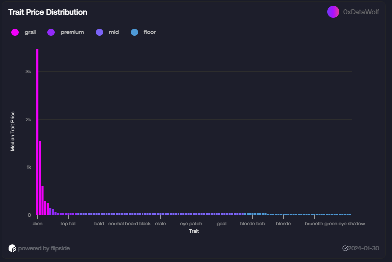

# DeepNFTValue NFT Index

The deprecated dashboard can be found [here](https://flipsidecrypto.xyz/0xDataWolf/nft-price-index-zO7ZZS) 

> **WARNING**: As the data provider, Flipside Crypto, has deprecated DeepNFTValue data. This markdown serves as a documentation on this work. There are some learnings from this approach that I think is worth documenting for future use

## Background and Motivation
As the name implies, Non-Fungible Tokens (NFTs) are tokens (or assets) with various characteristics that makes each asset different from each other. This is the "non-fungible" component because they are not exactly interchangable. 

This also implies that, due to the differences in certain attributes, the market prices these assets differently.

You can think of it this way: Perhaps a house is worth more because there is less glare from the morning sun or it is near a school. Its pretty obvious that no two homes would cost the same, or are interchangeable, because there are plenty of factors that affects their price

Likewise, some NFTs are valued more because they have cool attributes that people want: For instance, the red panda with its various clothes is worth a lot more than a plain looking cat

## Problem Statement

Due to the reasons above, a few questions arise. To help non-crypto people reading this, I've attempted to "translate" the implications and reasoning behind the questions to help you frame the question better 🙂

1) **What are some price trends given the attributes of an NFT collection?**
   * *Translated: Are homes that are near schools getting more expensive over time*

2) **What is the driver of an NFT's price**
   * *Translated: What is making a home expensive? Distance? Number of Bedrooms?*

3) **What is the general price trend across price cohorts for a collection? Can we compare this with other NFT collections?**
   * *Translated: Are expensive homes in New York getting more expensive at a faster rate than cheaper homes in New York?*
   * *Translated: Are expensive homes in New York getting more expensive at a faster rate than expensive homes in Texas?*

**Why are these questions important?**

1. The more expensive NFTs are usually a leading sign of an NFT's collection health and status. Purchase and price appreciation in the more coveted NFTs show conviction and seeing this data helps in investment decisions

2. If an NFT investor wants to get into a collection, is he better off buying the cheapest NFT in the collection or should he go for quality?

## Methodology
### Data Scope

**DeepNFTValue**

The price provided is from DeepNFTValue. They are company that uses machine learning to predict NFT prices by accounting their trading history and attributes. This is neccessary because not all NFTs are traded and to get a complete picture of them we need to "fill in the gaps"

Think of it this way: 
* Home A with 3 bedrooms + driveway is sold
* But Home B with 3 bedrooms with no driveway isn't. 

What is the worth of Home B? We can use other homes (e.g Home A) to make a guess for Home B. 

**Flipside Crypto**

This is a data provider that has onchain crypto data. They are hosting DeepNFTValue's data as well and have free compute and dashboard making capabilities

### NFT Collection Coverage

We are limited to the number of collections available from Flipside. Here are the list of NFT collections

1. CryptoPunks
2. Bored Ape Yacht Club
3. Pudgy Penguins
4. Azuki
5. Mutant Ape Yacht Club
6. Azuki
7. Nakamigos

### A mental model on how NFTs are categorized
___

In the NFT community, there are usually 4 implicit ways NFTs are grouped

1. **Grails**: Are usually the rarest in terms of a particular trait or are the top few most expensive due to a series of highly desired attributes

2. **Premium**: Also has rare traits and are fairly expensive relative to the rest of the NFTs but are a little cheaper than grails

3. **Mids**: An arbitraty mid tier

4. **Floor**: Usually the cheapest in the collection. Interestingly, floors are used to monitor the general price performance of an NFT because if the cheapest tokens are priced higher, then the rest of the above tiers would follow as well. Think of it as *Lowest Price + some financial premium = NFT Price* This is why the floor price is a widely followed metric to gauge the health of an NFT collection

So what does the above tell us: the attirbutes, or traits, of the NFT largely drives drive price. By mapping out and ranking the trait's price. We can find what traits are valuable and assign a category of an NFT

For instance, here is a graph of the Red Panda trait. We see that NFTs with the red panda trait are sold at a price close to the median price of the Red Panda trait.

The observant reader may notice: Hey why are some NFTs sold a much higher price than the median red panda price? The answer is because these NFTs probably have a trait that is more valuable. For instance:

We see that although this is a red panda (and we can't see it!), it has a very rare blue bucket headgear (9 in existance). Therefore, it commands a higher premium

To recap based on what we have learnt:
1. NFT prices are (usually) driven by their most expensive traits
2. The value of the trait can be proxied by looking at the series of NFTs with that particular trait

For this analytical project, the median price of all NFTs with a particular trait is mapped is calculated

# Categorizing NFTs by looking at their most valuable traits. 

Here is a quick overview of how their categories are determined

Based on the SQL script, here's how the different NFT price tiers are determined through a series of sequential filters and calculations:

## Floor Tokens
1. First removes supergrails from the dataset (becase skew)
2. Calculates weights using the formula: sqrt(1 / (trait_adjusted_price / sum(trait_adjusted_price)))
3. Floor tokens are those with weights >= average weights

## Mids (Split into Lower and Upper)
**Lower Mids:**
1. Removes floor tokens
2. Uses similar weight calculation as floor
3. Lower mids are tokens with weights >= average weights

**Upper Mids:**
1. Removes lower mids tokens
2. Calculates weights using: 1 / (trait_adjusted_price / sum(trait_adjusted_price))
3. Upper mids are tokens with weights >= average weights

## Premium (Split into Lower and Upper)
**Lower Premium:**
1. Removes upper mids tokens
2. Uses same weight formula as upper mids
3. Lower premium tokens are those with weights >= average weights

**Upper Premium:**
1. Removes lower premium tokens
2. Calculates weights using: (trait_adjusted_price / sum(trait_adjusted_price))²
3. Upper premium tokens are those with weights < average weights

## Grails
**Determined through multiple methods:**
1. Supergrails via 99.9th percentile
2. One-of-one grails (unique tokens)
3. Non-one-of-one grails (based on weighted calculations)
4. Any remaining tokens above upper premium threshold

The final price tier labels are assigned as:
- Floor: <= max_floor price
- Mid: Between max_floor and max_upper_mids
- Premium: Between max_upper_mids and min_grail
- Grail: >= min_grail price

# Tracking a collections category performance

From here on out the job becomes easier because we have assigned a label to each NFT. Then we calculate their price performance over time by creating a baseline of 100 points. Then for each day, the changes on the initial 100 point is added/subtracted to get performance in absolute terms

This is similar to how the S&P is calculated

Here we can see that grails are largely flat in value but the rest of the other tiers fluctuate wildly (especially floors). This suggest that for traders, its better to gain trade floors while collectors should focus on grails.

# Building the Index

This index tracks the performance of NFTs across different collections by categorizing them into labels (like "floor," "mid," "premium," and "grail") and then calculating a weighted average of their returns.

**Monthly Rebalancing:**

The index is rebalanced monthly. This means the label assigned to each NFT is held constant for the entire month. The label assigned on the last day of a month is used for the whole following month. This prevents excessive trading and reflects a buy-and-hold strategy typical of many NFT investors.

**Market Capitalization Weighting:**

The index uses market capitalization weighting. This means the return contribution of each collection is proportional to its market capitalization. A collection with a larger market cap will have a bigger influence on the overall index performance than a collection with a smaller market cap.  This reflects the significance of each collection within the broader NFT market.

**Index Calculation:**

The index is calculated daily using the following steps:

1. **Daily Returns:**  The percentage change in price is calculated for each NFT within its assigned label.

2. **Weighted Averaging:**  These daily returns are then averaged within each collection and label. These average returns are further weighted by the collection's market capitalization proportion, giving more weight to larger collections.

3. **Blended Returns:**  Finally, these weighted average returns are summed across all collections for each label, producing a single, blended daily return for each label.

4. **Index Level:** The daily returns for each label are used to calculate the label index value from a base value using the compounding effects of returns. This approach is the same across all labels allowing meaningful comparison on returns between different rarity groups or baskets within NFT projects.  The overall index represents a combined, weighted picture of the performance of these labeled segments of the NFT market.

Now we are able to see the price performance for each category with across the 6 collections listed above. This acts as a barometer in understanding boom and busts.

This is the market cap of the 6 collections. The relative proportions are used to weight returns

